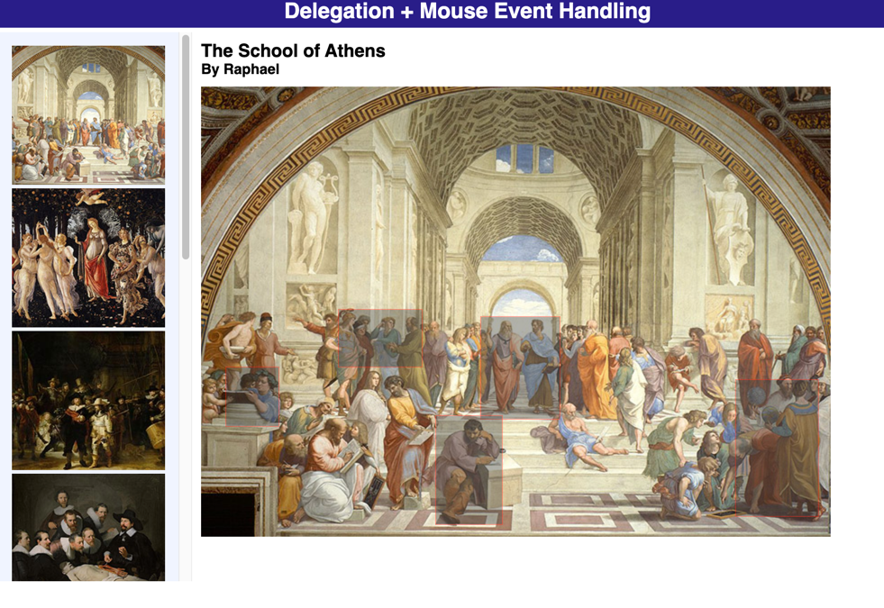
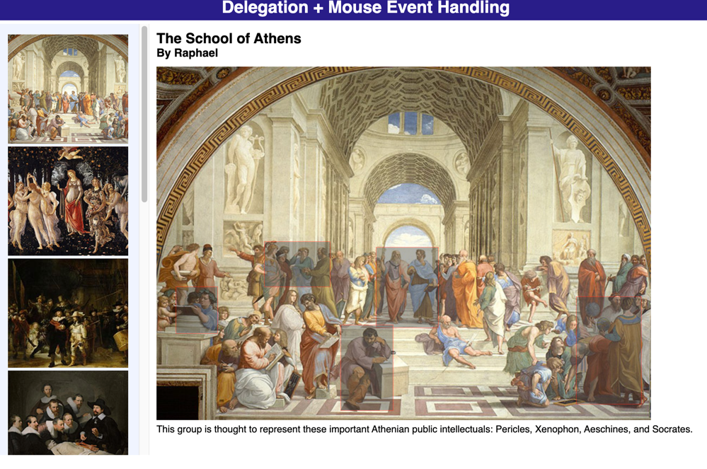

# In-class DOM activity 002

## Forking this repo
To work on this project, you will need to create a personal copy of the repository. This is done by forking it. Follow these steps:
### 1. Fork repository
   - Click the “Fork” button located in the upper right corner of the repository page.
   - This will create a copy of the repository under your GitHub account. (only one in the project will do this!)
### 2. Clone Your Fork
   - On your GitHub account, navigate to your forked repository.
   - Clone the forked repository to your local machine.
### 3. Adding Collaborators
   - Add your project members in the same way as you would for a normal repository.
   - Go to `Settings`, `Collaborators` to add members to this repo.
### 4. New branch
   - ***VERY IMPORTANT*** -> Create a new branch before you make any changes to the forked repo!!
   - Once the branch is created, make the changes as per project requirements.
   - You can make as many commits and as many pushes as needed to that branch that was newly created.
   - To be consistent, use the same styling for commit messages that was given in the Project I.
     - [Prefix] – [Short description of the change]
       The following are the only possible options for [Prefix]:
     - [FEAT] - For new features or major additions to the project.
       - Example: `FEAT - Added contact form to the Contact page`
     - [FIX] - For bug fixes, corrections, or revisions to the code.
       - Example: `FIX - Corrected navigation bar alignment on mobile devices`
     - [STYLE] - For stylistic changes such as formatting, CSS modifications, or minor visual updates.
       - Example: `STYLE - Updated color scheme for better contrast`
     - [DOCS] - For changes or additions to the documentation, including README files and comments in the code.
       - Example: `DOCS - Added project description and setup instructions to README`
     - [SECURITY] - For changes related to improving the security of the website.
       - Example: `SECURITY - Implemented input validation for contact form`
     - [REFACTOR] - For code refactoring that doesn’t change functionality but improves code quality or organization.
       - Example: `REFACTOR - Organized CSS files and cleaned up redundant styles`
     - [TEST] - For adding tests or making changes to the testing suite.
       - Example: `TEST - Added validation tests for contact form input`

### 5. Submitting your work
Once, you are sure that all the work is completed, go through the following steps for submission.
   - Go to your forked repository on GitHub. 
   - Click on the “Pull requests” tab and then the “New pull request” button. 
   - Select the branch you pushed your changes to. 
   - Click “Create pull request” and provide a title and description for your changes. 
   - Submit the pull request.
   - If you have made a pull request on error or have made further changes to the branch, you can always close the pull request that was made and make a new pull request.
   - The closest pull request to the due date will be reviewed.

### 6. Grading and Feedback
- After the submission deadline, your pull request will be reviewed.
- Feedback and grades will be provided based on the changes made and the quality of the work.

Not sure, how to create a pull request, check this [link](https://docs.github.com/en/pull-requests/collaborating-with-pull-requests/proposing-changes-to-your-work-with-pull-requests/creating-a-pull-request-from-a-fork).

# Project description

You have been provided with the necessary styling and markup already, all the files needed are present in the repo.  Examine `domactivity.html` in the editor of your choice. You will be
programmatically adding elements based on user actions and data in the  supplied JSON file. 

1. Examine paintings.json. This data file consists of an array of paintings. The id
   of each painting element corresponds to the image file name (there is a smaller
   version and a larger version in two different subfolders inside of the images
   folder). Each painting also has an array of features. You will be displaying
   rectangles based on the x,y coordinates of the features. When the user mouses
   over a feature rectangle, your page will display the feature description below
   the painting.

2. Begin by modifying `domactivity.js` and add a DOMContentLoaded event handler.
   ***All of your code will be inside that handler.*** Your handler will need to use the
   JSON.parse() method to transform the JSON data into a JavaScript object. You
   will also need to loop through the data array and generate a list of thumbnail
   images of the paintings inside the supplied `<ul>` element.  
3. You ***MUST*** use event delegation (i.e., a ***single event handler***) to process all clicks
   in the painting list. When a painting is clicked, first empty the `<figure>` element
   (simply by assigning empty string to the innerHTML property). This is necessary
   to remove the previously displayed image features. After emptying the `<figure>`,
   display a larger version of the painting (inside the supplied `<figure>` element)
   and display its title and artist in the supplied `<h2>` and `<h3>` elements (Check the figure above). This will
   require you to find the painting in your painting array that matches the id value
   of the clicked thumbnail;
4. When a new painting is clicked, you will also need to loop through the
   features array for that painting and display rectangles on top of the painting.
   Each feature has the upper-left and lower-right coordinates for the feature.
   Each rectangle will be a `
` element that you programmatically construct
   and append to the `<figure>`. You will need to assign it the class box (the CSS
   for this class has been provided) and set the position, left, top, width, and
   height properties. The respective values for these properties will be absolute,
   the upper-left x value from features array element, the upper-left y value
   from features array element, while the width and height are calculated by
   subtracting the lower-right x,y from upper-left x,y. Note: the left, top, width,
   and height properties must include the px unit when assigning the value. The second picture had the mouse hovered over the first rectangle, which triggered the appropriate script to display the text corresponding to the first box. Note: The mouse is not visible in the picture.
5. For each rectangle, you will also need to set up mouseover and mouseout event
   handlers. For the mouseover, you will need to set the textContent property of
   the provided description `
` with the description property of the feature
   data for that rectangle. For mouseout, simply empty the content of the
   textContent.

## Tips and Suggestions
* Start small: Figure out the smaller working parts of the HTML, like adding the small images on the left side of the HTML.
* **DON’T USE ABSOLUTE PATHS**. Use only relative paths in your project files. This practice is particularly important when multiple people are working on the same project, as it ensures that links and references work correctly across different environments and systems.
* Iterate and Test: Continuously test your website after making necessary changes.
* Issues: Use the GitHub to create Issues and track the status of the issues using Milestones.
* Focus on Details: Pay attention to small details like spacing, hover effects, to create a polished final product.

